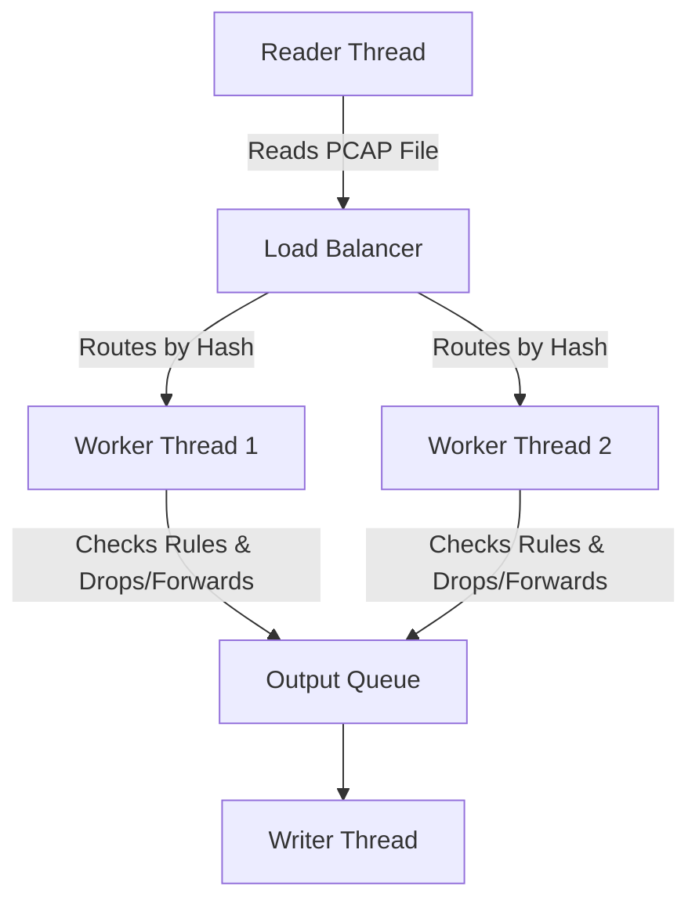

# NetScope DPI Lite: Deep Packet Inspection Engine

> **A Multithreaded Layer-7 Network Traffic Analyzer in C++17**  
> *Built to demonstrate backend systems programming, networking, and observability skills.*

<p align="center">
  
</p>

## 🎯 Project Overview
Standard firewalls block traffic based on IP addresses, which is often insufficient for modern network management. NetScope operates at **Layer 7** of the OSI model. It reads the raw bytes of network packets to extract application data (like YouTube, TikTok, or Netflix) and enforces blocking rules in real-time. 

By analyzing the Server Name Indication (SNI) inside TLS handshakes and the Host headers in HTTP traffic, NetScope can accurately classify and filter encrypted and unencrypted traffic dynamically.

---

## ✨ Core Features (Tech Stack & Skills)
- **Programming Language:** C++17 (Modern C++, Pointers, Move Semantics, RAII)
- **Deep Packet Inspection:** Manually parses Ethernet, IPv4, TCP, UDP, and TLS headers. Extracts the Server Name Indication (SNI) to classify HTTPS traffic without relying on massive external DPI libraries.
- **Multithreading:** Uses a Producer-Consumer pattern with `std::thread`, `std::mutex`, `std::condition_variable`, and Lock-free atomics for high-performance concurrency.
- **DevOps:** Fully containerized using Docker & Docker Compose for easy deployment. This avoids "It works on my machine" issues caused by different C++ compiler versions.
- **Observability:** Custom embedded HTTP server exports real-time metrics (like throughput and drop rates) to Prometheus and Grafana dashboards.

---

## 🏗️ System Architecture
The engine is designed as a high-performance pipeline connected by thread-safe queues.



- **Reader Thread:** Reads the PCAP file, parses the foundational network headers, and extracts the payload offset.
- **Load Balancer Thread:** Uses a mathematical hash based on the 5-tuple (IPs and Ports) to route packets to workers.
- **Worker Threads:** Inspects the L7 payload, checks the blocking rules, updates Prometheus metrics, and forwards valid packets.
- **Writer Thread:** Saves the allowed packets back to the disk as a filtered PCAP file.

---

## 🧗 Challenges & Solutions

Building a multithreaded backend system from scratch presented several engineering hurdles that required creative problem-solving:

1. **The "Multithreading is Slower" Problem:** Initially, workers shared a single flow-tracking map protected by a Mutex lock. The lock contention caused 4 threads to run slower than 1 thread because they were constantly waiting in line to read the map.
   - **Solution:** I implemented **Flow Affinity**. By hashing the IPs in the Load Balancer, all packets for a specific connection always go to the exact same worker thread. This allowed me to remove the Mutex lock entirely, unlocking linear performance scaling.
   
2. **Memory Crashes (OOM):** The fast file reader flooded the workers with packets faster than they could be processed, causing RAM to fill up and the OS to crash.
   - **Solution:** I engineered bounded thread-safe queues. If a queue hits its limit (e.g., 10,000 packets), the producer thread goes to sleep. This creates **Backpressure**, keeping memory usage perfectly flat regardless of traffic spikes.
   
3. **High CPU Usage from Data Copying:** Copying massive 1500-byte packets between threads was destroying CPU cache performance.
   - **Solution:** I utilized C++11 `std::move`. Instead of copying the packet data, the engine simply transfers the pointer ownership between threads, resulting in highly efficient **Zero-Copy memory management**.

---

## 🌍 Real-World Use Cases for DPI
Deep Packet Inspection is a critical technology used across the networking industry. Building this project helped me understand how these real-world systems operate:
1. **Enterprise Security & WAFs:** Firewalls like Palo Alto use L7 DPI to block malware or unauthorized applications (e.g., blocking BitTorrent or Tor on a corporate network).
2. **Parental Controls & ISP Filtering:** ISPs use DPI to filter out adult content or block illegal streaming domains dynamically, regardless of what IP address the server uses.
3. **Zero-Rating (Telecom):** Telecom operators use DPI to identify traffic from specific apps (like WhatsApp or Spotify) so they can offer "Free Data" for those applications.

---

## 🔮 Future Roadmap
While the current engine is fully functional for PCAP analysis, there are several systems-level enhancements planned for future versions:
- **AWS Cloud Deployment:** Deploying the Dockerized stack to an AWS EC2 instance for a live, always-on demonstration of the Grafana dashboard.
- **Live Traffic Capture (`AF_PACKET`):** Bypassing PCAP files to capture and inspect live ethernet frames directly from the Linux kernel using raw sockets.
- **TCP Stream Reassembly:** Implementing a sliding-window buffer to reconstruct fragmented TLS ClientHello messages across multiple TCP packets.

---

## 🚀 How to Run Locally (Localhost)

You can easily run the entire C++ engine, Prometheus, and Grafana on your local machine using Docker.

### 1. Prerequisites
Make sure you have [Docker Desktop](https://www.docker.com/products/docker-desktop) installed on your local machine.

### 2. Clone and Start
Open your terminal and run the following commands:
```bash
# Clone the repository
git clone https://github.com/rajakumar123-commit/NetScope-DPI-Lite.git
cd NetScope-DPI-Lite

# Start the full stack in the background
docker-compose up --build -d
```

### 3. View the Analytics Dashboard
Open your web browser and navigate to the Grafana dashboard:
- **URL:** `http://localhost:3000`
- **Username:** `admin`
- **Password:** `admin`

### 4. Customizing Rules
You can edit the `rules.conf` file locally to add new blocking rules (like blocking YouTube or specific IPs). After saving the file, just restart the container to see the new rules take effect!
