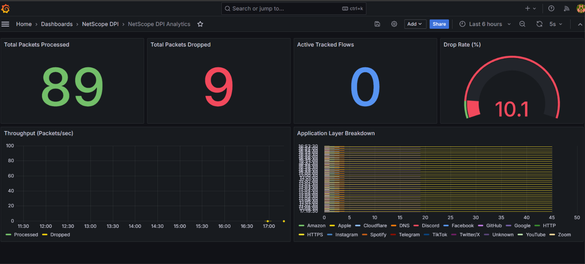
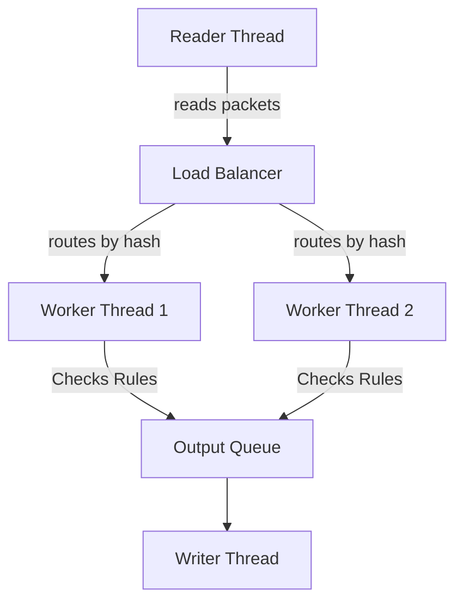

# NetScope DPI Lite

A multithreaded network traffic inspector built from scratch in C++17. 

This project was built to learn how deep packet inspection (DPI) works, how to manage threads and queues in C++, and how to build a real-time observability dashboard using Prometheus and Grafana.

---

## 📊 Dashboard Preview

<p align="center">
  
</p>

---

## What Does This Project Do?

Standard firewalls block internet traffic based on IP addresses. NetScope looks deeper into the actual packet data (Layer 7). 

Even though HTTPS traffic is encrypted, the very first packet sent to a website (the TLS ClientHello) contains the website's name in plain text (the SNI). NetScope reads this name, identifies if you are connecting to YouTube, TikTok, or Netflix, and blocks the connection if it's not allowed in the rules file.

## What I Learned Building This

1. **C++ Memory Management:** I learned how to use `std::move` to pass large 1500-byte packets between threads without slowing down the CPU by copying data.
2. **Multithreading:** I built a Producer-Consumer system where one thread reads the file, and multiple "Worker" threads process the packets at the same time.
3. **Preventing Deadlocks & Crashes:** I learned how to use Hash Maps to route packets so threads don't step on each other's data (removing the need for slow Mutex locks), and I used "Backpressure" queues so the program doesn't run out of RAM.
4. **Networking:** I manually parsed Ethernet, IPv4, TCP, UDP, and TLS headers by reading raw memory bytes.
5. **Docker & Cloud:** I containerized the whole project using a multi-stage Dockerfile so it can be easily run anywhere, including AWS EC2.

---

## 🏗️ Simple Architecture



---

## 🚀 How to Run the Project

### Using Docker (Recommended)
This runs the C++ engine, the Prometheus metrics server, and the Grafana dashboard all at once.

```bash
# 1. Start the containers
docker-compose up --build -d

# 2. View the dashboard in your browser
# Go to: http://localhost:3000 (Username: admin / Password: admin)
```

### Building Locally (Linux)
```bash
# Generate sample traffic
python3 tests/generate_test_pcap.py

# Build the C++ code
mkdir build && cd build
cmake ..
make -j4

# Run the engine
./netscope_dpi --pcap ../pcaps/test_dpi.pcap --workers 4
```

---

## ⚙️ How to Add Blocking Rules

You can easily block apps or websites by editing the `rules.conf` file:

```conf
# Block by Application Name
block_app YouTube
block_app TikTok

# Block by Domain
block_domain *.betting-site.com

# Block by Port
block_port 4444
```

---

## ☁️ How to Deploy on AWS EC2

This project is completely ready to be deployed to the cloud for a live demonstration.

1. Create a free **Ubuntu** EC2 instance on AWS.
2. In the Security Group settings, open Port **22** (for SSH) and Port **3000** (for Grafana).
3. SSH into your server and install Docker:
   ```bash
   sudo apt update && sudo apt install -y docker.io docker-compose
   ```
4. Clone this repository to the server.
5. Inside the folder, run:
   ```bash
   sudo docker-compose up --build -d
   ```
6. Open your browser and go to `http://<Your-EC2-Public-IP>:3000` to see your live dashboard!

---
*Created as a portfolio project to demonstrate backend systems engineering skills.*
