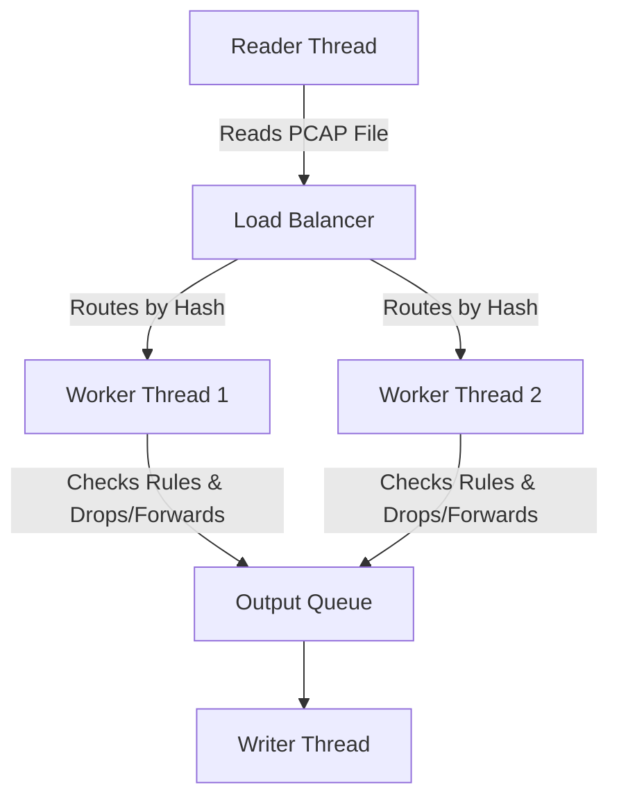

# NetScope DPI Lite: Systems Engineering Portfolio Project

> **A Multithreaded Deep Packet Inspection (DPI) Engine in C++17**  
> *Built to demonstrate backend systems programming, network protocol analysis, and cloud deployment skills.*

<p align="center">
  
</p>

## 🎯 Project Overview

NetScope DPI Lite is a from-scratch network traffic analyzer. While standard firewalls block traffic based on IP addresses, this project operates at **Layer 7** of the OSI model. It reads the raw bytes of network packets to extract application data (like YouTube, TikTok, or Netflix) and enforces blocking rules in real-time.

**Why I built this:** To transition my knowledge of theoretical operating systems and networking into a highly practical, multithreaded systems application.

## 🛠️ Tech Stack & Keywords (ATS Friendly)

- **Programming Language:** C++17 (Modern C++, Move Semantics, Pointers)
- **Concurrency & Multithreading:** `std::thread`, `std::mutex`, `std::atomic`, `std::condition_variable`, Producer-Consumer Pattern, Lock-free design concepts
- **Networking Protocols:** TCP/IP, UDP, IPv4, DNS, TLS (SNI Extraction), HTTP Headers, POSIX Sockets
- **DevOps & Cloud:** Docker, Docker Compose, AWS EC2 (Ubuntu Linux)
- **Observability:** Prometheus (Metrics), Grafana (Dashboards)

## 🏆 Key Engineering Achievements

1. **Zero-Copy Memory Management:** Instead of wasting CPU cycles copying large 1500-byte packets, the engine uses C++11 `std::move` to instantly transfer pointer ownership between threads.
2. **Eliminated Thread Deadlocks:** Built a Load Balancer that routes packets using "Flow Affinity" (hashing the IPs). This allows threads to work independently on their own Hash Maps without needing slow Mutex locks.
3. **Bounded Memory (Backpressure):** Engineered custom thread-safe queues with maximum capacity limits. If the reader is too fast, the system naturally slows down instead of crashing from Out-Of-Memory (OOM) errors.
4. **Byte-Level Protocol Parsing:** Bypassed heavy external libraries (like `libpcap`) and manually parsed Ethernet, IP, TCP, and TLS headers using pointer arithmetic.
5. **Real-Time Observability:** Exposed an embedded HTTP metrics server that uses `std::atomic` to serve live data to Prometheus and Grafana without slowing down the packet processing.

---

## 🏗️ System Architecture



---

## 🚀 How to Run the Project (Docker)

The easiest way to view the project is through the pre-configured Docker containers.

```bash
# 1. Start the C++ engine, Prometheus, and Grafana
docker-compose up --build -d

# 2. View the live analytics dashboard in your browser
# URL: http://localhost:3000
# Username: admin | Password: admin
```

## ☁️ AWS EC2 Cloud Deployment

This project is fully ready for cloud deployment:
1. Launch a free-tier **Ubuntu 22.04** instance on AWS EC2.
2. Open **Port 22** (SSH) and **Port 3000** (Grafana) in the AWS Security Group.
3. Install Docker via terminal: `sudo apt install docker.io docker-compose`.
4. Clone this repository and run `sudo docker-compose up --build -d`.
5. Access the live dashboard at `http://<EC2-Public-IP>:3000`.

---
*Created as a fresher-level portfolio piece to demonstrate core competencies in Backend Engineering, Systems Programming, and DevOps.*
