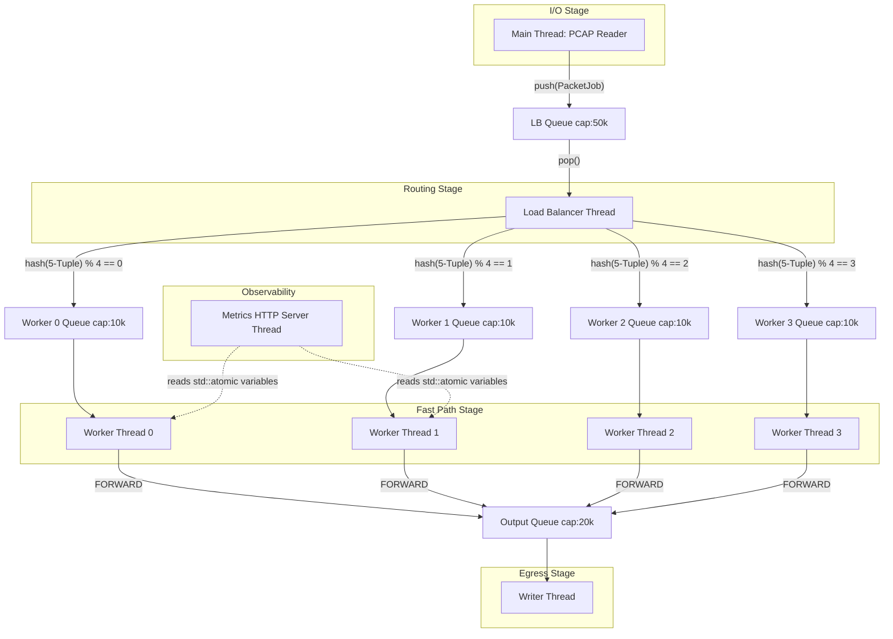

# NetScope DPI Lite — System Architecture

This document breaks down the core architecture of NetScope DPI Lite, explaining the multithreading model, flow affinity, and the data structures that allow the engine to inspect network traffic at high speeds.

---

## 1. Complete System Architecture

NetScope is designed as a **Producer-Consumer pipeline** connected by bounded, thread-safe queues. This design isolates disk I/O, packet routing, and deep packet inspection into discrete, concurrent stages.



---

## 2. The Thread Model & Design Decisions

The engine spawns `N + 3` threads (where $N$ is the number of Fast Path Workers, defaulting to 4).

### 2.1 The Reader Thread (Producer)
- **Role:** Sequentially reads Ethernet frames from the disk.
- **Design Decision:** PCAP files must be read sequentially. The reader allocates a raw buffer, parses the L2/L3/L4 headers, determines the payload offset, and packs this into a `PacketJob`.
- **Optimization:** Memory is aggressively conserved. The `PacketJob` takes ownership of the payload via `std::move`. The buffer is never copied during its entire lifecycle.

### 2.2 The Load Balancer Thread (Router)
- **Role:** Pops `PacketJob`s from the LB queue and decides which worker should process them.
- **Design Decision:** Decoupling reading from routing ensures that bursty disk I/O does not block the routing logic, and vice versa.

### 2.3 The Fast Path Workers (Consumers)
- **Role:** Perform the heavy lifting—TLS parsing, string matching, rule enforcement.
- **Design Decision:** This is where multithreading provides the biggest benefit. Parsing L7 protocols requires CPU time. By distributing flows across $N$ workers, we scale the most expensive operation linearly.

### 2.4 The Writer Thread
- **Role:** Takes packets marked as `FORWARD` and writes them to the output PCAP.
- **Design Decision:** Disk writes are slow. If workers wrote directly to disk, they would stall. A dedicated writer queue ensures workers immediately return to processing the next packet.

---

## 3. Flow Affinity & Worker-Local Trackers

### The Problem with Global State
DPI is **stateful**. The engine must remember that packet 1 (TCP SYN) belongs to the same flow as packet 4 (TLS ClientHello). 
A naive implementation would store all flows in a single `std::unordered_map<FiveTuple, Connection>` protected by a `std::mutex`. 

**Why it fails:** If 4 workers process 1 million packets per second, they will fight for the `std::mutex` 1,000,000 times a second. Lock contention would destroy the CPU, rendering multithreading useless.

### The Solution: Flow Affinity
NetScope enforces **Flow Affinity**. The LoadBalancer routes packets based on a hash of the connection's **5-tuple** (Source IP, Destination IP, Source Port, Destination Port, Protocol).

```cpp
// Normalized to ensure Client->Server and Server->Client hash identically
FiveTuple canonical = tuple.normalised();
size_t worker_idx = FiveTupleHash{}(canonical) % num_workers;
```

Because hashing is deterministic, **all packets belonging to the same flow are guaranteed to be processed by the exact same worker thread**.

**The Result:** 
Each FastPathWorker owns a *private* `ConnectionTracker`. Since no other thread ever touches a worker's tracker, **no mutex is needed**. Flow state lookup is completely lock-free and occurs at O(1) speed.

---

## 4. Queues and Backpressure

All threads communicate via `ThreadSafeQueue<T>`.

### The Synchronization Primitive
The queue uses a `std::mutex` and two `std::condition_variable`s (`not_empty_` and `not_full_`).

### Backpressure Implementation
Queues have a fixed maximum capacity (`max_size_`).
If a Worker encounters a complex TLS packet and slows down, its input queue fills up. When it hits capacity, the LoadBalancer attempting to `push()` will hit `not_full_.wait()`, putting the LB thread to sleep.
If the LB goes to sleep, the LB Input Queue fills up. When it hits capacity, the Reader thread goes to sleep.

**Design Decision:** This cascading slowdown is called **backpressure**. It prevents producers from overwhelming consumers, guaranteeing bounded memory usage (preventing OOM crashes) regardless of traffic spikes.

---

## 5. Metrics Subsystem (Atomics)

The engine exposes real-time statistics (packets processed, latency, apps detected) to Prometheus.

### The Locking Dilemma
If workers locked a mutex every time they processed a packet to update `total_packets`, we would re-introduce the exact bottleneck we solved with Flow Affinity.

### The Solution: `std::atomic`
All statistical counters in the `DPIStats` struct are typed as `std::atomic<uint64_t>`.

```cpp
stats_->total_packets.fetch_add(1, std::memory_order_relaxed);
```

**Design Decision:** Using `std::memory_order_relaxed` allows the CPU to increment the counter atomically (preventing torn reads/writes) without enforcing strict memory ordering barriers. On x86, this compiles to a single, hardware-accelerated `LOCK XADD` instruction. 
The background `MetricsServer` thread can safely read these values concurrently without interrupting the Fast Path workers.

---

## 6. Summary of Key Architectural Principles

1. **Share Nothing (Where Possible):** Use flow affinity to give each worker private state.
2. **Lock-Free Where Shared:** Use `std::atomic` for metrics instead of mutexes.
3. **Readers-Writer Locks for Policy:** The `RuleManager` uses `std::shared_mutex` so multiple workers can read blocking rules concurrently, blocking only when an admin updates a rule.
4. **Move Semantics:** Use `std::move` to transfer ownership of raw data bytes across thread boundaries, ensuring zero-copy performance.
